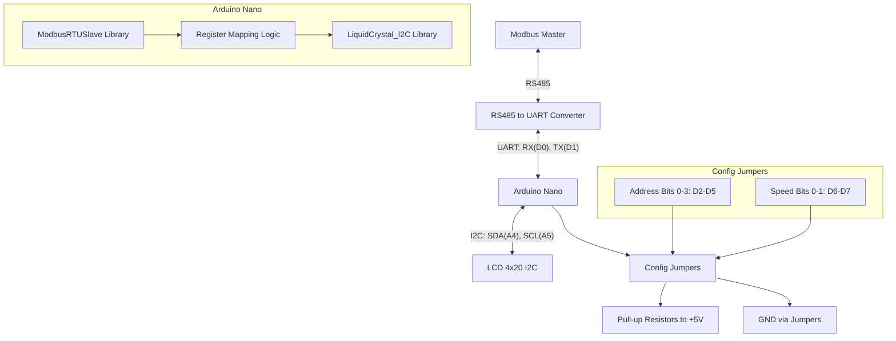

# Схема регистров Modbus для управления LCD дисплеем 4x20 I2C

## Общая информация
- Arduino выступает в роли Modbus Slave устройства
- Используются только 16-битные регистры для единообразия
- Все регистры являются Holding Registers (для записи) и Input Registers (для чтения) если необходимо

## Карта регистров

### Буфер кадра экрана (регистры 0-99)
| Адрес | Назначение | Формат данных | Описание |
|-------|------------|---------------|----------|
| 0-99 | Буфер кадра экрана | UINT16 | Каждый регистр содержит 2 символа: старший байт (первый символ) и младший байт (второй символ) |

### Системная информация (регистры 100-109)
| Адрес | Назначение | Формат данных | Описание |
|-------|------------|---------------|----------|
| 100 | Версия прошивки | UINT16 | Версия прошивки устройства |
| 101 | Статус устройства | UINT16 | 1 - готов, 0 - не готов |
| 102 | Ошибки устройства | UINT16 | Код ошибки устройства (0 - нет ошибок) |
| 103 | Текущий адрес Modbus | UINT16 | Текущий адрес устройства (1-16) |
| 104 | Текущая скорость Modbus | UINT16 | Текущая скорость обмена (в сотнях бод) |
| 105-109 | Зарезервировано | UINT16 | Для будущего использования |

### Управление экраном (регистры 110-119)
| Адрес | Назначение | Формат данных | Описание |
|-------|------------|---------------|----------|
| 110 | Команда очистки экрана | UINT16 | 1 - очистить экран, 0 - нет команды |
| 111 | Статус выполнения очистки экрана | UINT16 | 1 - выполнено, 0 - ожидание, 2 - ошибка |
| 112 | Включение/выключение отображения | UINT16 | 1 - включить отображение, 0 - выключить отображение |

## Протокол обмена данными

### Работа с буфером кадра
1. Master может читать и записывать регистры 0-99 для получения/установки содержимого экрана
2. Каждый регистр содержит 2 символа: старший байт (первый символ) и младший байт (второй символ)
3. При изменении содержимого регистров 0-99 содержимое экрана автоматически обновляется
4. Символы с кодом 0x00 не выводятся на экран, что позволяет корректно отображать строки с нечетным количеством символов

### Очистка экрана
1. Master устанавливает команду "1" в регистре 110
2. Slave выполняет команду очистки экрана
3. Slave устанавливает статус "1" в регистре 111

## Архитектура системы

## Конфигурация устройства

### Настройка адреса Modbus и скорости обмена
Устройство поддерживает настройку адреса Modbus и скорости обмена через джамперы, подключенные к входам Arduino. Входы подтянуты к +5В через резисторы, а джамперы замыкают их на землю для установки битов в 1.

#### Адрес Modbus (биты 0-3)
- 4 входа (D2-D5) задают адрес устройства (1-16)
- Замыкание входа на землю (LOW) устанавливает бит в 1
- Без джамперов (все биты 0) — адрес 16 (по умолчанию)

| Джамперы (D5-D2) | Биты | Адрес |
|------------------|------|-------|
| 0000 (без джамперов) | 0000 | 16 |
| 0001 | 0001 | 1 |
| 0010 | 0010 | 2 |
| 0011 | 0011 | 3 |
| 0100 | 0100 | 4 |
| 0101 | 0101 | 5 |
| 0110 | 0110 | 6 |
| 0111 | 0111 | 7 |
| 1000 | 1000 | 8 |
| 1001 | 1001 | 9 |
| 1010 | 1010 | 10 |
| 1011 | 1011 | 11 |
| 1100 | 1100 | 12 |
| 1101 | 1101 | 13 |
| 1110 | 1110 | 14 |
| 1111 | 1111 | 15 |

#### Скорость обмена (биты 4-5)
- 2 входа (D6-D7) задают скорость обмена
- Замыкание входа на землю (LOW) устанавливает бит в 1
- Без джамперов (00) — скорость 9600 бод (по умолчанию)

| Джамперы (D7-D6) | Биты | Скорость (бод) |
|------------------|------|----------------|
| 00 (без джамперов) | 00 | 9600 |
| 01 | 01 | 19200 |
| 10 | 10 | 57600 |
| 11 | 11 | 115200 |

#### Регистры конфигурации
- Регистр 103: Текущий адрес устройства (1-16, только чтение)
- Регистр 104: Текущая скорость обмена (в сотнях бод, только чтение)
- Регистры 105-109: Зарезервировано для будущих параметров конфигурации

### Подключение пинов

#### UART (Serial) для Modbus связи:
- RX (приемник) - цифровой пин 0
- TX (передатчик) - цифровой пин 1
- Используется для подключения к RS485 преобразователю

#### I2C для подключения LCD:
- SDA (данные) - аналоговый пин A4
- SCL (тактирование) - аналоговый пин A5
- Используется для подключения LCD дисплея 4x20 I2C

## Возможное дальнейшее развитие проекта

### Управление подсветкой экрана
- Регистр 120: Команда управления подсветкой (0 - выключить, 1 - включить)
- Регистр 121: Статус подсветки (0 - выключена, 1 - включена)

### Управление видимостью курсора
- Регистр 122: Команда управления курсором (0 - скрыть, 1 - показать)
- Регистр 123: Статус курсора (0 - скрыт, 1 - видим)

### Включение/выключение дисплея
- Регистр 124: Команда управления дисплеем (0 - выключить, 1 - включить)
- Регистр 125: Статус дисплея (0 - выключен, 1 - включен)

### Создание пользовательских символов
- Регистры 130-193: Данные для создания до 8 пользовательских символов (по 8 байт на символ, 16 бит на байт)

## План реализации

### Среда разработки
Проект реализуется в Visual Studio Code с использованием PlatformIO для Arduino Nano.

### Платформа по умолчанию
Arduino Nano для компактности решения.

### Приоритеты реализации функций
1. Буфер кадра экрана (регистры 0-99)
2. Очистка экрана (регистры 110-111)
3. Системная информация и статус (регистры 100-109)
4. Конфигурация через джамперы
5. Обработка ошибок
6. Тестирование и отладка

### Этапы разработки
1. Настройка Arduino с библиотеками ModbusRTUSlave и LiquidCrystal_I2C
2. Реализация буфера кадра экрана (регистры 0-99)
3. Автоматическое обновление экрана при изменении регистров
4. Реализация очистки экрана (регистры 110-111)
5. Системная информация и статус (регистры 100-109)
6. Конфигурация через джамперы
7. Обработка ошибок
8. Тестирование и отладка

## Используемые библиотеки
1. LiquidCrystal_I2C - для работы с экраном: https://github.com/markub3327/LiquidCrystal_I2C
2. ModbusRTUSlave - для Modbus коммуникации: https://github.com/CMB27/ModbusRTUSlave